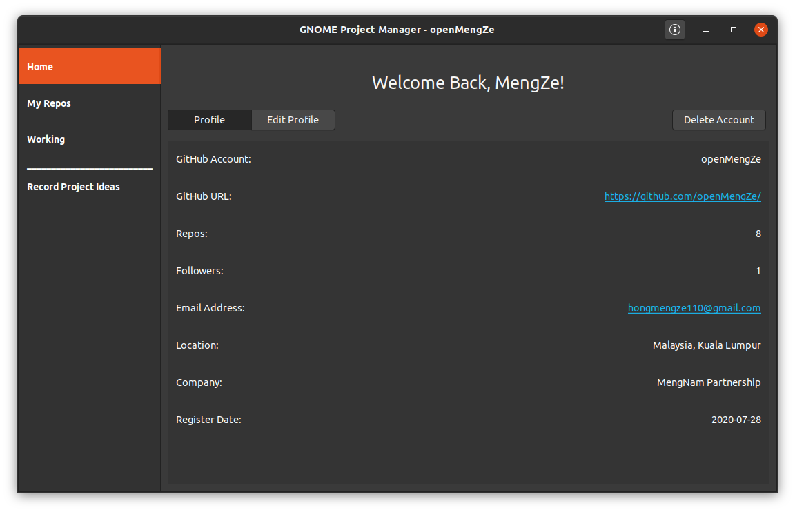
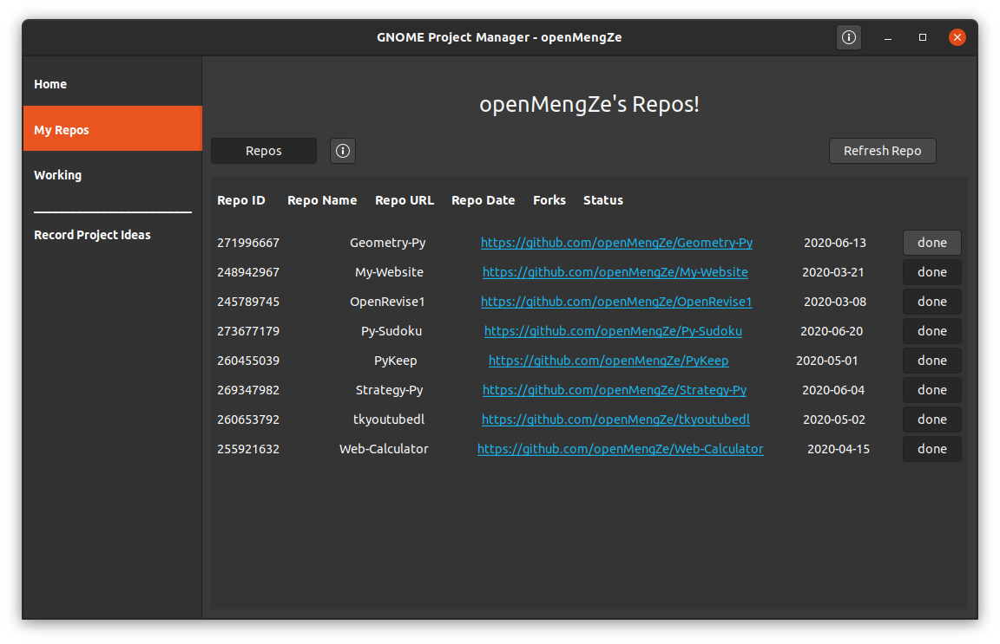
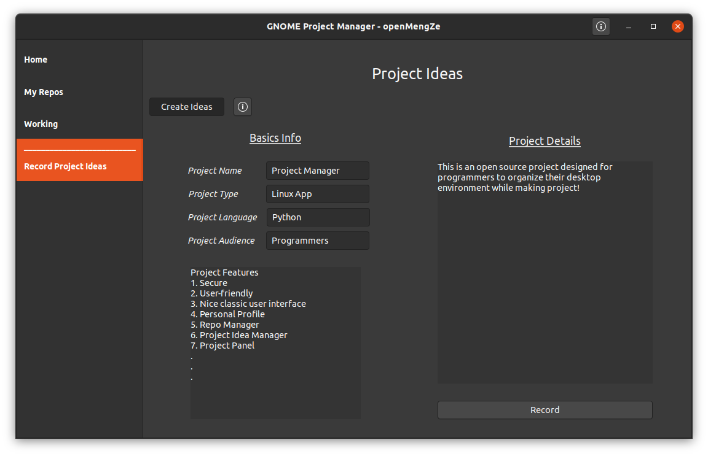
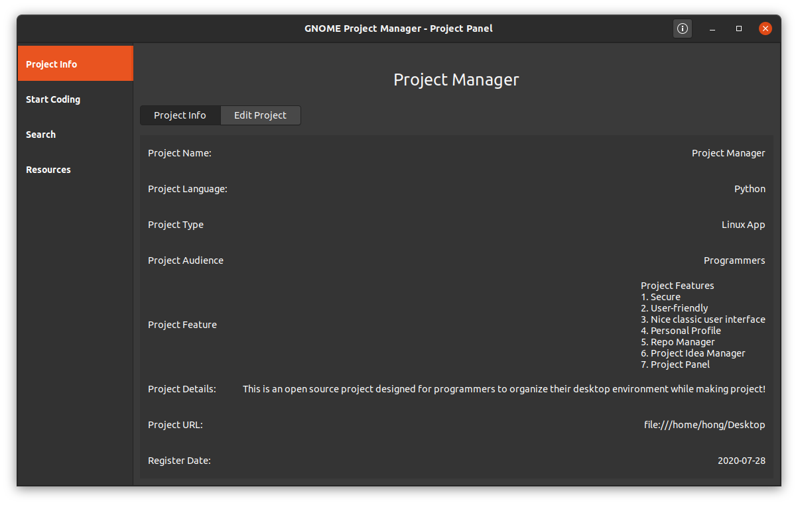
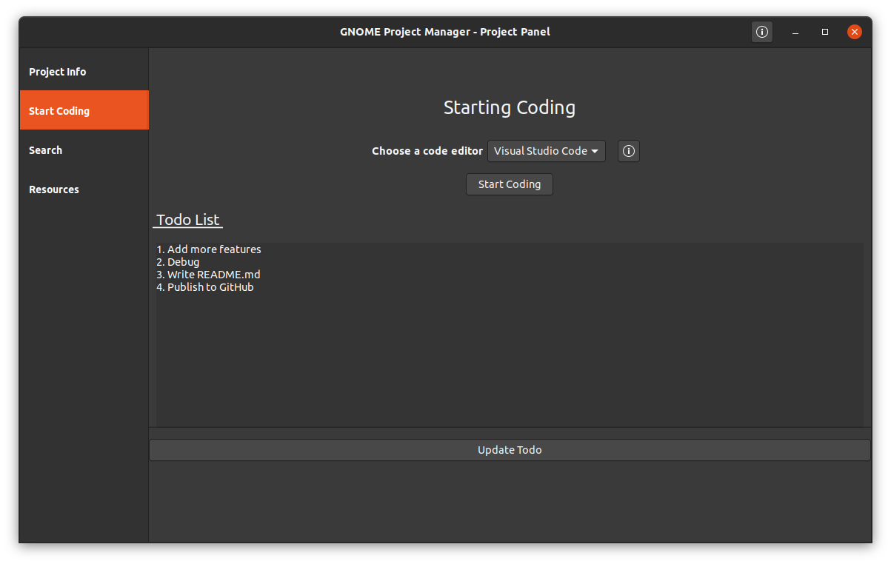
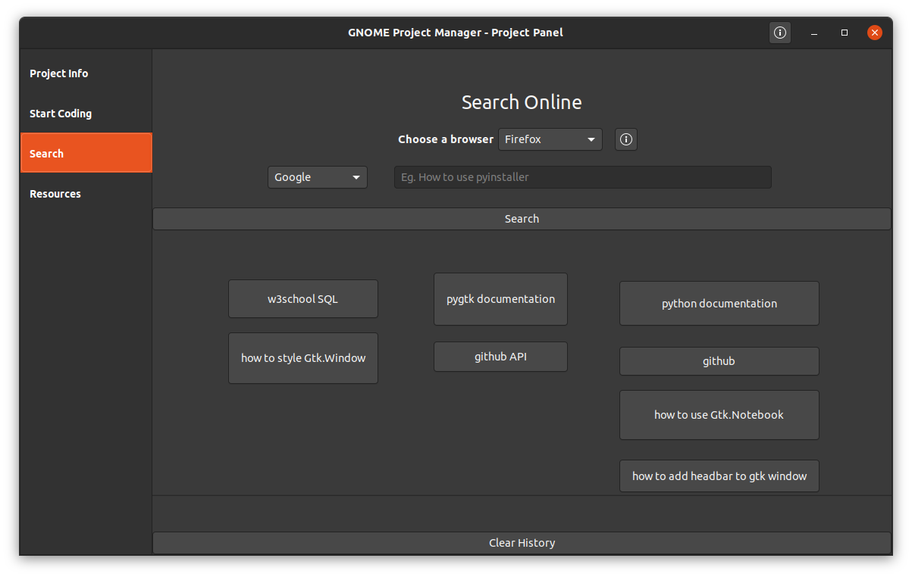

# GNOME Project Manager

## Introduction

Have you ever felt tired about opening a ton of softwares (IDE, To-Do List, Web Browsers etc.) and having a messy desktop environment while developing a large project? GNOME Project Manager will solve all your problems!

## Features

- **Authentication System** - keep your data secure with personal account!
- **Classic GNOME user interface** - Use **dark theme** for best experience
- **Personal Profile** - Manage your data (number of repositories, GitHub followers etc.) at one place!
- **Repositories Manager** - Manage all your public repositories **offline**!
- **Project Idea Manager** - Have a good project idea in mind but no time to work on it? Record your project idea safely with encryption and work on it later! 
- **Project Panel** - Currently working on a project? Keep track of all the project information with unique **project profile**!
- **Programming Environment** - 
  - Start coding with your favorite IDE with just one click!
  - A simple To-Do List that keep all your tasks organized!
  - Stack on a bug? Search online using the built-in **Search** feature connected to Google and StackOverflow with **search history** enabled!
  - Bookmark useful resources (documentations, tutorials etc.)!

## Screenshots

## Thanks

- https://python-gtk-3-tutorial.readthedocs.io/
- https://stackoverflow.com/questions/7160737/python-how-to-validate-a-url-in-python-malformed-or-not

## Licensee

[MIT](https://choosealicense.com/licenses/mit/)

